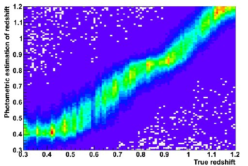

# Photometric Redshifts Estimation

*This project is ongoing and subject to continuous advancements and modifications.*

 

## Project Overview

This project focuses on estimating photometric redshifts, which are crucial for studying the large-scale structure of the universe and the distribution of galaxies. It employs Gaussian processes as a flexible non-parametric approach to effectively model uncertainties in photometric data. The project also integrates various data analysis techniques to enhance accuracy and performance, offering a comprehensive framework for photometric redshift estimation and other ML and AI methods, benchmarking between them to observe each method's performance in terms of accuracy and computational time.


## Features

- **Gaussian Process Regression**: Leverage Gaussian processes to estimate redshifts, allowing for a quantifiable measure of uncertainties.
- **Data Handling and Preprocessing**: Tools for cleaning and preparing synthetic datasets based on the Sloan Digital Sky Survey (SDSS).
- **Advanced Data Analysis**: Combines Gaussian processes with other statistical and machine learning techniques to enhance predictive power.
- **Visualization Tools**: Includes tools for visualizing redshift distributions, error margins, and overall model performance.
- **Thorough Documentation**: Detailed explanations and example notebooks for easy understanding and reproducibility.





## Requirements

- **Python Version**: Python 3.8+  
- **Key Packages**:  
  - **Core Scientific Libraries**: NumPy, Pandas, SciPy  
  - **Machine Learning and Statistical Modeling**: Scikit-Learn, GPflow  
  - **Visualization Tools**: Matplotlib, Seaborn  
  - **Astronomy-Specific Tools**: Astroquery, Astropy  
  - **Deep Learning (Optional)**: TensorFlow
  - **Utilities**: tqdm, h5py

## Getting Started

1. **Clone the Repository**
   ```bash
   git clone https://github.com/Adrita-Khan/AstroPhotoZ.git
   ```
2. **Install Dependencies**
   ```bash
   pip install -r requirements.txt
   ```
3. **Run Example Notebooks**

To help you get started with the project, you can run the following example notebooks:
1. [`Photometric_Redshift_Dataset_Exploration.ipynb`](EDA/Photometric_Redshift_Dataset_Exploration.ipynb): An exploratory analysis of the photometric redshift dataset to understand underlying patterns and features.
2. [`Synthetic_Photometric_Redshift_Predictor.ipynb`](Simulated%20Data%20Analysis/Notebooks/Synthetic_Photometric_Redshift_Predictor.ipynb): A step-by-step guide to predicting photometric redshifts using synthetic data.
3. [`Sample_Galaxy_Redshift_Prediction_py.ipynb`](Redshift_Analysis/Sample_Galaxy_Redshift_Prediction_py.ipynb): An example notebook for predicting galaxy redshifts using real data.


## Usage

Follow the notebooks to apply Gaussian processes (notebooks and scripts will be updated and shared as the work progresses) and other data analysis techniques to photometric data. Hyperparameters and methods can be adjusted to suit specific research requirements.
## Contributing

Contributions are welcome! Please feel free to open issues, suggest improvements, or submit pull requests.

## License

This project is licensed under the MIT License.

## Resources

### Tutorials and Demos
- [Scikit-Learn Astronomy Regression Tutorial](https://ogrisel.github.io/scikit-learn.org/sklearn-tutorial/tutorial/astronomy/regression.html)
- [Photo-z Regression Demo - Mofokeng Chaka](https://github.com/mofokeng-chaka/Classification-Photo-z_Regression_Demo)
- [Multi-Wavelength Classification and Regression](https://github.com/mofokeng-chaka/Classification-Photo-z_Regression_Demo/blob/master/Multi-Wavelength_Classification_and_Regression.ipynb)
- [PhotoZ_SDSS by Tasos Theodoropoulos](https://github.com/TasosTheodoropoulos/Photoz_SDSS)
- [TITAN Project - PhotoZ SDSS ML](https://github.com/TITAN-Project-EU/PhotoZ_SDSS_ML)
- [Photometric Redshifts - Martian Side of the Moon](https://github.com/martiansideofthemoon/Photometric-Redshifts)
- [AstroML - Forest Photometric Redshift Estimation](https://www.astroml.org/book_figures/chapter9/fig_photoz_forest.html)
- [Photometric Redshift Estimation - Amber](https://github.com/AstronomerAmber/Machine-Learning)
- [Photometric Redshift Estimation by Qbeer](https://qbeer.github.io/photometric-redshift-estimation/)
- [MLZ: Machine Learning Redshifts](https://github.com/mgckind/MLZ)

### AstroML Resources
- [Photo-z using k-Nearest Neighbors](https://www.astroml.org/examples/learning/plot_neighbors_photoz.html)
- [Compute SDSS PCA](https://www.astroml.org/examples/datasets/compute_sdss_pca.html)

### Deep Learning
- [Photometric Redshift Using Deep Learning - Shreever Shith](https://github.com/shreevershith/EstimationOfPhotometricRedshiftUsingDL)

### SDSS Data and Tools
- [SDSS4 DR16Q Tutorial by Qiaoya Wu](https://github.com/QiaoyaWu/sdss4_dr16q_tutorial)
- [SDSS DR8 Data Access](https://www.sdss3.org/dr8/data_access.php)
- [SDSS DR9 Photo-z Algorithms](https://www.sdss3.org/dr9/algorithms/photo-z.php)
- [SDSS DR17 Photo-z Algorithms](https://www.sdss4.org/dr17/algorithms/photo-z/)
- [sdss Python Package](https://pypi.org/project/sdss/)
- [Astroquery SDSS Documentation](https://astroquery.readthedocs.io/en/latest/sdss/sdss.html)
- [Astroquery SDSS API](https://astroquery.readthedocs.io/en/latest/api/astroquery.sdss.SDSSClass.html)
- [SDSS DR14 SkyServer SQL Search](https://skyserver.sdss.org/dr14/en/tools/search/sql.aspx)
- [SDSS DR18 SkyServer SQL Search](https://skyserver.sdss.org/dr18/en/tools/search/sql.aspx)

### Additional Resources

- [SDSS DR17 Algorithms - Photo-z](https://www.sdss4.org/dr17/algorithms/photo-z/?utm_source=chatgpt.com): A comprehensive guide to the photometric redshift algorithms used in SDSS DR17.
- [The Dark Energy Survey Data Management System](https://www.researchgate.net/publication/51942136_The_Dark_Energy_Survey_Data_Management_System/figures?lo=1): Explore figures and insights from the Dark Energy Survey, focusing on data management and redshift estimation techniques.
- [Understanding Redshift - Sky at Night Magazine](https://www.skyatnightmagazine.com/space-science/redshift): A detailed article explaining the concept of redshift, its significance in astronomy, and its applications in understanding the universe.
- [Hubble Law Introduction](https://astro.wku.edu/astr106/Hubble_intro.html): An introductory resource on Hubble's Law and its implications in cosmology.

---

<h2><u>Contact</u></h2>
For any inquiries or feedback, please contact:


**Adrita Khan**  

*[📧 Email](mailto:adrita.khan.official@gmail.com) | [🔗 LinkedIn](https://www.linkedin.com/in/adrita-khan) | [🐦 Twitter](https://x.com/Adrita_)*
