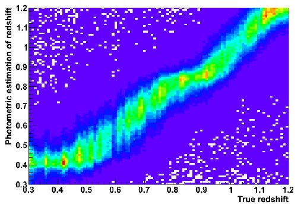

# Photometric Redshift Estimation Using Machine Learning Approaches

*This research project is currently under active development and subject to ongoing refinements.*

 

## Abstract

This repository presents a comprehensive framework for photometric redshift estimation, a fundamental measurement in extragalactic astronomy and cosmology. The project employs Gaussian Process Regression as a non-parametric Bayesian method to model photometric redshift–spectroscopic redshift relationships while quantifying prediction uncertainties. Through systematic comparison of multiple machine learning algorithms, this work establishes a rigorous benchmarking framework that evaluates model performance in terms of prediction accuracy, computational efficiency, and uncertainty quantification. The methodology is designed for application to wide-field X-ray surveys and deep multi-wavelength astronomical datasets.


## Research Objectives

| Phase | Objective | Description |
|-------|-----------|-------------|
| **1** | **Methodology Validation** | Implement and validate Gaussian Process Regression and complementary machine learning techniques using spectroscopically confirmed samples from the Stripe 82X survey, establishing baseline performance metrics for subsequent applications. |
| **2** | **Reproducibility Assessment** | Apply the validated methodology to legacy datasets to demonstrate consistency with previously published photometric redshift catalogs, ensuring algorithmic robustness and reproducibility. |
| **3** | **Extension to Sparse Datasets** | Adapt the framework for wide-field X-ray surveys with incomplete spectroscopic coverage, including XMM-XXL, while developing strategies to address inhomogeneous spatial and wavelength coverage. |
| **4** | **Multi-Survey Performance Evaluation** | Conduct comparative analysis across surveys of varying depth and completeness to assess methodology scalability and identify optimal application domains. |
| **5** | **Application to Uncharacterized Fields** | Deploy the methodology to X-ray selected Active Galactic Nuclei samples lacking spectroscopic redshifts, enabling mass estimation and large-scale structure studies through advanced machine learning techniques. |

## Methodology

### Gaussian Process Regression

This project implements Gaussian Process Regression, a Bayesian non-parametric approach that provides:

- Flexible modeling of complex, non-linear relationships between photometric colors and redshift
- Rigorous uncertainty quantification through predictive variance estimates
- Minimal assumptions regarding functional form of the underlying redshift–color relationship

### Data Processing Pipeline

The framework incorporates comprehensive data preprocessing capabilities including:

- Quality control and filtering procedures for multi-wavelength photometric catalogs
- Feature engineering from photometric measurements (colors, magnitudes, errors)
- Treatment of missing data and photometric upper limits
- Standardization protocols aligned with Sloan Digital Sky Survey (SDSS) data products

### Comparative Machine Learning Analysis

Multiple regression algorithms are implemented and benchmarked according to the following framework:

| Algorithm | Primary Strengths | Computational Complexity |
|-----------|------------------|-------------------------|
| **Gaussian Process Regression** | Uncertainty quantification, non-parametric flexibility | O(n³) training, O(n²) prediction |
| **Random Forest Regression** | Robust to outliers, handles high-dimensional data | O(n log n × trees) |
| **Gradient Boosting Machines** | High accuracy, feature importance ranking | O(n × trees × depth) |
| **Neural Networks** | Complex pattern recognition, scalability | Variable (architecture-dependent) |

**Performance Metrics:**

| Metric | Definition | Interpretation |
|--------|------------|----------------|
| **RMSE** | Root Mean Square Error | Overall prediction accuracy |
| **σ<sub>NMAD</sub>** | Normalized Median Absolute Deviation | Robust scatter estimate |
| **Outlier Fraction** | |Δz| > 0.15 × (1 + z<sub>spec</sub>) | Catastrophic failure rate |
| **Computational Runtime** | Wall-clock time for training/prediction | Scalability assessment |

### Visualization and Diagnostic Tools

The repository includes publication-quality visualization utilities for:

- Photometric versus spectroscopic redshift comparisons
- Redshift probability distribution functions
- Error analysis and outlier diagnostics
- Feature importance and model interpretability assessments




## Technical Requirements

### System Requirements

| Component | Requirement |
|-----------|-------------|
| **Python Version** | 3.8 or higher |
| **Operating System** | Platform-independent (Linux, macOS, Windows) |
| **Memory** | Minimum 8 GB RAM recommended for large datasets |
| **Storage** | Varies by dataset size (typically 1–10 GB) |

### Dependencies

#### Core Scientific Computing

| Package | Version | Purpose |
|---------|---------|---------|
| NumPy | Latest stable | Numerical array operations |
| Pandas | Latest stable | Tabular data manipulation |
| SciPy | Latest stable | Scientific computing routines |

#### Machine Learning and Statistical Modeling

| Package | Version | Purpose |
|---------|---------|---------|
| Scikit-Learn | Latest stable | Classical machine learning algorithms |
| GPflow | Latest stable | Gaussian Process modeling with TensorFlow backend |

#### Visualization

| Package | Version | Purpose |
|---------|---------|---------|
| Matplotlib | Latest stable | Static plotting library |
| Seaborn | Latest stable | Statistical data visualization |

#### Astronomical Data Handling

| Package | Version | Purpose |
|---------|---------|---------|
| Astroquery | Latest stable | Astronomical database query interface |
| Astropy | Latest stable | Core astronomy data structures and utilities |

#### Deep Learning (Optional)

| Package | Version | Purpose |
|---------|---------|---------|
| TensorFlow | 2.x | Neural network implementations |

#### Utilities

| Package | Version | Purpose |
|---------|---------|---------|
| tqdm | Latest stable | Progress monitoring |
| h5py | Latest stable | HDF5 data format support |

## Installation and Setup

### Repository Access

```bash
git clone https://github.com/Adrita-Khan/AstroPhotoZ.git
cd AstroPhotoZ
```

### Dependency Installation

```bash
pip install -r requirements.txt
```

### Jupyter Notebook Examples

| Notebook | Purpose | Location |
|----------|---------|----------|
| **Exploratory Data Analysis** | Statistical characterization and visualization of photometric redshift training datasets | [`Photometric_Redshift_Dataset_Exploration.ipynb`](EDA/Photometric_Redshift_Dataset_Exploration.ipynb) |
| **Synthetic Data Validation** | Methodology validation using simulated photometric observations with known redshift distributions | [`Synthetic_Photometric_Redshift_Predictor.ipynb`](Simulated%20Data%20Analysis/Notebooks/Synthetic_Photometric_Redshift_Predictor.ipynb) |
| **Observational Data Application** | End-to-end pipeline demonstration using real astronomical survey data | [`Sample_Galaxy_Redshift_Prediction_py.ipynb`](Redshift_Analysis/Sample_Galaxy_Redshift_Prediction_py.ipynb) |

## Usage Guidelines

The provided notebooks demonstrate the complete workflow from data ingestion through model training, validation, and uncertainty quantification. Hyperparameters, feature selections, and algorithmic choices may be modified to accommodate specific survey characteristics and scientific requirements. Users are encouraged to consult inline documentation and docstrings for detailed implementation guidance.

## Contributions

This project welcomes contributions from the astronomical and data science communities. Potential contributors are encouraged to submit issues for bug reports or feature requests, and to propose improvements through pull requests following standard collaborative development practices.

## License

This software is distributed under the MIT License, permitting unrestricted use, modification, and distribution subject to the terms specified in the LICENSE file.

## References and Resources

### Methodological Tutorials

| Resource | Author/Organization | Description |
|----------|-------------------|-------------|
| [Scikit-Learn Astronomy Regression Tutorial](https://ogrisel.github.io/scikit-learn.org/sklearn-tutorial/tutorial/astronomy/regression.html) | Scikit-Learn | Introduction to regression techniques for astronomical data |
| [Classification and Photo-z Regression Demo](https://github.com/mofokeng-chaka/Classification-Photo-z_Regression_Demo) | Mofokeng Chaka | Demonstrations of classification and regression methods |
| [Multi-Wavelength Classification and Regression](https://github.com/mofokeng-chaka/Classification-Photo-z_Regression_Demo/blob/master/Multi-Wavelength_Classification_and_Regression.ipynb) | Mofokeng Chaka | Multi-wavelength analysis techniques |
| [PhotoZ_SDSS](https://github.com/TasosTheodoropoulos/Photoz_SDSS) | Tasos Theodoropoulos | SDSS photometric redshift implementations |
| [TITAN Project PhotoZ](https://github.com/TITAN-Project-EU/PhotoZ_SDSS_ML) | TITAN Project EU | Machine learning approaches to SDSS photo-z |
| [Photometric Redshifts Analysis](https://github.com/martiansideofthemoon/Photometric-Redshifts) | Martian Side of the Moon | Comprehensive photo-z analysis framework |

### AstroML Library Resources

| Resource | Topic | Link |
|----------|-------|------|
| **Forest Regression Example** | Random forest photo-z estimation | [Documentation](https://www.astroml.org/book_figures/chapter9/fig_photoz_forest.html) |
| **k-Nearest Neighbors** | KNN-based photo-z | [Example](https://www.astroml.org/examples/learning/plot_neighbors_photoz.html) |
| **PCA Analysis** | Principal component analysis for SDSS | [Example](https://www.astroml.org/examples/datasets/compute_sdss_pca.html) |

### Advanced Machine Learning Implementations

| Repository | Author | Focus Area |
|------------|--------|------------|
| [Machine Learning Approaches](https://github.com/AstronomerAmber/Machine-Learning) | Amber | Various ML techniques for astronomy |
| [Deep Learning for Photo-z](https://github.com/shreevershith/EstimationOfPhotometricRedshiftUsingDL) | Shreever Shith | Neural network architectures |
| [Photo-z Estimation Tutorial](https://qbeer.github.io/photometric-redshift-estimation/) | Qbeer | Comprehensive tutorial |
| [MLZ: Machine Learning for Redshifts](https://github.com/mgckind/MLZ) | Matias Carrasco Kind | Production-level ML framework |

### SDSS Data Access and Documentation

#### Data Release Resources

| Resource | Data Release | Type |
|----------|-------------|------|
| [DR16Q Tutorial](https://github.com/QiaoyaWu/sdss4_dr16q_tutorial) | DR16 | Quasar catalog tutorial |
| [Data Access Portal](https://www.sdss3.org/dr8/data_access.php) | DR8 | Data download interface |
| [Photo-z Algorithms](https://www.sdss3.org/dr9/algorithms/photo-z.php) | DR9 | Algorithm documentation |
| [Photo-z Technical Docs](https://www.sdss4.org/dr17/algorithms/photo-z/) | DR17 | Updated methodology |
| [SkyServer SQL Interface](https://skyserver.sdss.org/dr14/en/tools/search/sql.aspx) | DR14 | SQL query interface |
| [SkyServer SQL Interface](https://skyserver.sdss.org/dr18/en/tools/search/sql.aspx) | DR18 | Latest SQL interface |

#### Python Tools

| Tool | Purpose | Link |
|------|---------|------|
| **sdss Package** | SDSS data access library | [PyPI](https://pypi.org/project/sdss/) |
| **Astroquery.sdss** | Query interface for SDSS archives | [Documentation](https://astroquery.readthedocs.io/en/latest/sdss/sdss.html) |
| **API Reference** | Detailed API documentation | [Reference](https://astroquery.readthedocs.io/en/latest/api/astroquery.sdss.SDSSClass.html) |

### Survey Documentation and Theoretical Background

| Topic | Resource | Description |
|-------|----------|-------------|
| **SDSS Photo-z Algorithms** | [DR17 Documentation](https://www.sdss4.org/dr17/algorithms/photo-z/) | Technical specification of photometric redshift methodologies |
| **Dark Energy Survey** | [DES Data Management](https://www.researchgate.net/publication/51942136_The_Dark_Energy_Survey_Data_Management_System/figures?lo=1) | Data processing and photo-z techniques |
| **Redshift Theory** | [Sky at Night Magazine](https://www.skyatnightmagazine.com/space-science/redshift) | Observational cosmology fundamentals |
| **Hubble's Law** | [Educational Resource](https://astro.wku.edu/astr106/Hubble_intro.html) | Introduction to distance-redshift relation |

---

## Contact Information

**Adrita Khan**  
Email: [adrita.khan.official@gmail.com](mailto:adrita.khan.official@gmail.com)  
LinkedIn: [linkedin.com/in/adrita-khan](https://www.linkedin.com/in/adrita-khan)  
Twitter/X: [@Adrita_](https://x.com/Adrita_)

---

*For questions regarding methodology, data access, or collaboration opportunities, please contact the author via email or open an issue in the repository.*
